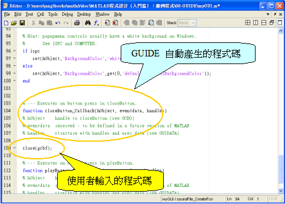

# :bird:Matlab 使用教學
---


[toc]
---
## Ch.0 Basics
**Matlab:**
:heavy_check_mark:
- Easy to use (toolbox, easy to code and see result)
- Graphical Interface (plot, 3D, spectrum, ...)

:x:
- **Not** used in industry
- Commercial (not free)
- Lacks low-level compatability

---

### Environment
 

**1. Current Folder**
* 顯示Working Folder下的所有file

**2. Current Path**
* 顯示目前Working Folder
* 如果要import `.m` 之類，就要放同一個folder比佢讀

**3. Editor**
* 類似寫program，寫完全部再禁`run`或者係Command window call就ok
* **Script**: 即係將一連串Command濃縮成一個file
* **Function**: Input Process Output
  * 留意用function的話, file name要同function name一樣
* :arrow_right: works like compiler

**4. Commmand Window**
* 同Terminal差不多, line by line execution
* :arrow_right: works like integrator

**5. Workspace**
* 顯示目前有定義的variables
* 如果無指定variable name, 最近一次計算結果就會叫`ans`

### Styles
- **Case Sensitive** -- 細`x` 同 大`X` 係兩個**完全唔一樣**的變數
- **Code Indent** -- Highlight完可以用右鍵->Smart Indent 或直接 `ctrl` + `i`自動幫你indent
- **Default data type** -- <font color="#F937A0"> double precision floating point </font>
- **Comment**
  - `%` (一行)
  - `ctrl` + `r` = Quote哂highlight緊ge野
  - `ctrl` + `t` = De-quote
- **Reserved Word** -- 有內建一堆預設數值的字(可以rewrite)
  - e.g. `pi`
- **End of line** -- `;`
  - 可加可不加
    - 有加: nothing special
    - **無**加: 會係execution過程將個value print出黎

  - Examples:
```Matlab
  a=1; (只會出現係Workspace入面)
  b=2  (print: >> b = 2)
```


### Creating a Matrix

- **Matrix**: Mathematical Representation
- **Array**: data storage form
- **n-by-m** matrix/array:
  - n = rows (橫列)
  - m = columns (直行)
- **Vector**: 1-dimensional array
- **Access an element**: 呢邊最大分別係**用細括號**`()`而**唔係**中括號`[]`去抽element
  - 另外, <font color="#F937A0" >first element係1</font>, 唔係0
  - e.g. `A(1,2)` Matrix: row 1, col 2 of A
- **Defining a Matrix**:
```Matlab
A = [1 2 ; 3 4]
whos A
B = [1 2 3 4]
whos B

% results: A size = 2x2
% results: B size = 1x4
```
> `[]`入面分號`;`代表換行，elements之間有無逗號都無所謂


### Iterations / Selections
---

`break`:直接脫離一切while, for loop

#### for loop
- Example 1
```Matlab
for i = 1:10
    a(i)=i;
end

% 結果為save 1-10的vector (length=10)
```
- Example 2
```Matlab
for i = (2 4 1 3 5 6 10 9 7 8)
    a(i)=i;
end

% 同上面結果一樣，不過可以學下for loop `i` 的用法 -> 直接指定一set數值比佢行
```

- Example 3
```Matlab
counter = 0;
for i = 0:0.1:10
    counter = counter+1;
    a(counter) = i;
end

% 結果為length = 101的vector，內容為 0, 0.1, 0.2, ..., 10
% 呢邊同樣可以留意for的用法，中間係interval
```
* **小心for loop陷阱**
  * `for (index = start:interval:end)`
  * 如果係`for i=1:2:10` , `i`**會係9停低**, $\because$ `i: 1->3->5->7->9`
#### while loop
```Matlab
i = 1;
while (i < 10)
    i = i+1;
end

% 結果: i = 10
```

#### if
```Matlab
i=1;
if (i<10)
	i = i+1;
end
```

* `else`直接寫係if後面, 唔需要`end`完再開`else` `end`

#### Switch
```Matlab
i = 0;
while (i<3)
      switch i
	case 1
	      i = i+1;
	case 2
	      i = i+2;
	otherwise
	      i = i+3;
     end
end

% 好似唔駛每個case後面都加break
% 另外 default 變成 otherwise
```

### Function

- Example
```Matlab
function [y1,y2] = name_of_fun(x1,x2)
y1 = x1 + x2;
y2 = x1 * x2;
  return ;
end;
```
  - `y1,y2`: output variables (optional)
  - `x1,x2`: input variables (optional)
  - `name_of_fun`: function name
    - 同program規則一樣, **第一個字唔可以係符號or數字**
  - **return statement** (optional)

### Operators
> 只列出較特別的operator

| Operator  |     Meaning     |
|:---------:|:---------------:|
| :car: `^` |      power      |
|   `==`    |    equal to     |
|    `~`    |     **NOT**     |
|   `~=`    |  Not equal to   |
|    `*`    | Matrix multiply |
|   `.*`    | Array multiply  |
|    `^`    |  Matrix power   |
|   `.^`    |   Array power   |


### Frequently used Command
* **清mem3寶**
    1. `clear` : 清variable
    2. `close` : 清figure/plot
    3. `clc`   : 清command window記錄
    * 通常係function/script file開頭都可以放個`clear all` + `close all`咁就放心啦
    * `clear`亦可以獨立拎黎清一個variable/ function
* `whos` : 查variable property (*size*, *type*, ...)
* `help` : 查function用法 e.g. `help plot`
* `input` : 要求使用者輸入字串
  * Example: `reply = input('Input Below\n','s');`
  * 好似無得直接input數字, 限死你用`'s'`(?)
* `randn` : gen亂數, 詳情自己入`help`睇
* `zeros` / `ones`
  * 比一個parameter佢就會產生n*n的matrix -> `zeros(4)` : 4\*4 matrix of '0'
  * 比兩個parameter佢就會產生n*m的matrix -> `ones(2,3)`: 2\*3 matrix of '1'
* `length` : 查變數長度
* `size` : 查變數dimension
* `disp` : Display array, debug神器 (或者直接變數後面唔加分號都得ge)
  * e.g. `disp('Hello');`
  * e.g. `someText = 'Hello'`
    - **不加分號**的話by default會print出黎，不過絕對唔好用係d大型matrix上面，會好麻煩

### Graphics (plot, subplot, figure)
> Graphic command要有先後順序，通常係:
>  1. `figure`
>  2. `subplot`
>  3. `plot`
>  4. `grid`, `legend`之類


**1. Plot**
- Syntax 1:
`plot(x,y,plot symbols);`
- Syntax 2: plotted 2 or more data on the same figure
`plot(x1, y1, plot symbols, x2, y2, plot symbols);`

```Matlab
t = 0:1:10;
y = exp(t);
plot(t, y, ‘r’) % red line
plot(t, y, ‘rx’) % red cross
plot(t, y, ‘ro-’) % red circle AND line
plot(t, y, ‘ro:’) % red circle AND dotted line

```

**2. Figure**
- 功能 = **開新視窗**
- Example
```Matlab
figure
plot(t,y1,'r-',t,y2,'bx');
grid on
xlabel('Hi');
ylabel('Bye');
legend('leg1','leg2');
```

@import "assets\Matlab_1.png" {width="450px" height="380px" title="figure example"}

**3. Subplot**
- Syntax:
  - `subplot(number of rows, number of columns, plot index)`
- Example
```Matlab
t = 0:1:10; s1=sin(t);c1=cos(t);t1=tan(t);
ct1=cot(t);sec1=sec(t);csc1=csc(t);

figure
subplot(2,3,1);
plot(t, s1);
xlabel('plot 1');

subplot(2,3,2);
plot(t, c1);
xlabel('plot 2');

subplot(2,3,3);
plot(t, t1);
subplot(2,3,4);
plot(t, ct1);
subplot(2,3,5);
plot(t, sec1);
subplot(2,3,6);
plot(t, csc1);
```
Results:
@import "assets\Matlab_2.png" {width="450px" height="380px" title="figure example"}

### Import functions
將網上找到的function call入去matlab用
1. Home :arrow_right: Set Path

2. Add Folder...

- 自己Add番裝住function個folder path就OK，matlab會自動搵set path底下的function(`.m`檔)

---
## Tips & Tricks

### Vector & Matrix
> Reference: Matlab array manipulation tips and tricks

**Operators**
`help ops`: Recommended!幫助了解Matlab operators & special characters
以下幾個特別有用:
- `help colon` =  `:` operators
- `help transpose` = `.'`
- `help ctranspose` = `'`


---

## Matlab GUI
> **START**
1. Type `guide` in command window'
    - **GUIDE** = Graphical User Interface **Developing Environment**
2. Choose **"Create New GUI"** --> **"Blank GUI"** --> OK
3. **"Save"** before you do anything
    - Save完會自動產生兩個同名的檔案，一個副檔名係`.m`，一個係`.fig`
    - `.m` for callback editing , `fig` for creating new objects / adjusting

> **Settings**
- 顯示物件說明
  1. Matlab: `Home` :arrow_right: `Preference` :arrow_right: `GUIDE`
  2. Check `Show names in component palette` :heavy_check_mark:
- 顯示尺規/格線
  1. `Tools` :arrow_right: `Grid and Rulers`
- etc. 其他有咩想set就自己搵啦

> **GUI 3寶** `set`,`get`,`gcf`

### Basics
- **Create Object**
  - 直接拉入去figure就得
  - 每次拉完新GUI object入去figure，都請你做以下動作:
  - Right Click --> **"Property Inspector"** --> **"Tag"** --> 改做你自己想用的variable name
  - 另外當你想直接用handles去`set`某一件object的field時，亦可以用**Property Inspector**黎查個個field叫咩名，非常好用
  - Others: Background Colors, **String**, etc...
- **Create Callback Functions**
  - 每件object有各自的callback functions，想佢對特定動作有反應，就請你做以下動作:
  - Right Click --> **"View Callbacks"** --> Choose the Function you want
  - 簡完就會自動係`.m`檔入面generate一段程式碼，再自行改動即可
  - [Types of Callbacks](http://matlab.izmiran.ru/help/techdoc/creating_guis/ch_program25.html)
  - e.g. **Button** 有五種
    - `Callback` = 最常用到，需要互動的objects都係用呢個(e.g. **button** clicked,**slider**, ...)
    - `CreateFcn` = 顧名思義
    - `DeleteFcn` = 顧名思義
    - `ButtonDownFcn` = 物件本身無`Callback`先會用到，滑鼠點擊即會觸發(e.g. **axes**)
    - `KeyPressFcn` = (?) matlab forum係教你用另一個`WindowsKeyPressFcn`代替
      - `set(f,'WindowKeyPressFcn',@keyPressCallback);`
        - `f` = your figure
        - `keyPressCallback` will be triggered whenever the figure/GUI has focus and a key on the keyboard is pressed
- **Debugging**
  - 建議你每次寫GUIDE的時候都拉一個**Static Text**/**Edit Text** 入去，方便Debug
    - or use `disp` (displayed on command window)

### Frequently used command
- `uigetfile`: pops up a dialog to select a file
  - e.g. `[filename pathname] = uigetfile({'*.*'});`
-  `fullfile`: combines the path name and file name into a complete file name.
- 另外要留意**唔可以亂用**`clear all`，會將GUI入面d handles一齊clear埋 (GG:smiley:)

### Callbacks
Callbacks (反應命令) = GUI物件被滑鼠點擊/操作時會執行的動作，若該動作是放置於Function底下，則稱為Callback Functions

reference: [GUIDE 入門範例](http://mirlab.org/jang/books/matlabProgramming4beginner/08-2_example01.asp?title=8-2%20GUIDE%20%A4J%AA%F9%BDd%A8%D2%A4@)



gcbf 代表產生此反應命令的視窗，因此 close(gcbf) 即是代表關閉此 GUI 介面所在的視窗。這一類的指令相當好用，可整理如下：
- gcf: get current figure （取得目前視窗）
- gca: get current axes （取得目前圖軸）
- gco: get current object （取得目前物件）
- gcbf: get callback figure （取得發號反應指令之視窗）
- gcbo: get callback object （取得發號反應指令之物件）

### Handles
- 官方翻譯叫"握把式物件" / "句柄"(?) 極難聽:confounded:
  - Match's Translate: Handles = 郵差 / 信件?
  - 即係相當於一種Pre-defined **Struct** / **Record** data type，方便你將Local Variables傳出傳入

**Passing Handles**
> Matlab Documentation: `guidata`

**1. Update/Saving**
  - `guidata(obj,data)`
    - 呢邊`obj`同`data`指的係某一種data type，不同情境(GUIDE or 直接code)下要pass不同variables
      - Argument 2 (`data`) 即係matlab入面稱作 **"handles"** 既data type
      - 其實即係裝住GUIDE入面所有Graphical Components資料的variable
    - GUIDE版本: `obj` 對應 `hObject`, `data` 對應 `handles`
      - $\therefore$ If you need to pass local variable out of that object in GUIDE, the correct code is `guidata(hObject,handles)`  

**2. Retrieving**
  - `data = guidata(obj)`
    - 呢邊`obj`一樣係指data type,GUIDE = `hObject`
    - 而`data`就係你自己用黎接住`guidata`傳出黎既資料的變數，**名稱隨意**
      - _`data`係matlab入面好似唔係reserved word,用`help data`搵無反應_
    - $\therefore$ correct code:  `wiki = guidata(hObject)`
  - 當你要用handles入面某一個資料，其實可以直接拎
    - e.g. `img = handles.stored_img`
    - 當然亦可以分兩行寫:
    ```Matlab
    wiki = guidata(hObject); %呢邊可以不加分號，咁Matlab就會將handles儲存緊的field print出黎
    img = wiki.stored_img;
    ```

---
